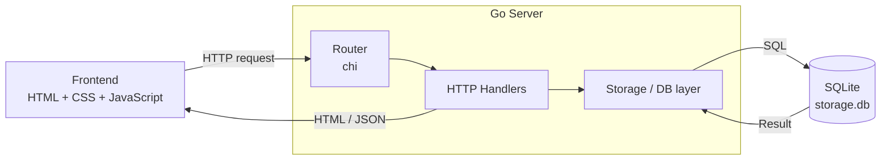

# Архитектура
Описание архитектуры проекта

```mermaid
flowchart LR
    Frontend["Frontend<br/>HTML + CSS + JavaScript"]

    subgraph Server["Go Server"]
        Router["Router<br/>chi"]
        Handler["HTTP Handlers"]
        Storage["Storage / DB layer"]

        Router --> Handler
        Handler --> Storage
    end

    DB[("SQLite<br/>storage.db")]

    Frontend -->|"HTTP request"| Router
    Handler -->|"HTML / JSON"| Frontend

    Storage -->|"SQL"| DB
    DB -->|"Result"| Storage
```
